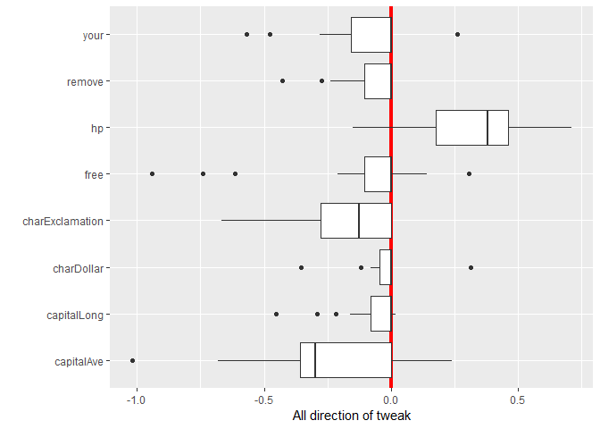

## Overview

an implementation to R-package of 
**Gabriele Tolomei, Fabrizio Silvestri, Andrew Haines, Mounia Lalmas "Interpretable Predictions of Tree-based Ensembles via Actionable Feature Tweaking". KDD 2017. [(arXiv)](https://arxiv.org/abs/1706.06691)**

## Installation

You can install the **featureTweakR** package from [GitHub](https://github.com/katokohaku/featureTweakR).


```r
install.packages("devtools") # if you have not installed "devtools" package
devtools::install_github("hoxo-m/pforeach") # if you have not installed "pforeach" package
devtools::install_github("katokohaku/featureTweakR")
```

The source code for **featureTweakR** package is available on GitHub at
- https://github.com/katokohaku/featureTweakR.

## Examples
### Data preparation

```r
set.seed(777)
require(tidyverse)
#> Warning: package 'tidyverse' was built under R version 3.4.3
#> Warning: package 'tibble' was built under R version 3.4.3
#> Warning: package 'dplyr' was built under R version 3.4.2
require(featureTweakR)

data(spam, package = "kernlab")
dataset <- sample_frac(spam) %>% dataSplit(test.ratio = 0.1)
#> [Split data] train : test = 4141 : 460 obs. (58 colmns)

important.var <- c("charExclamation", "charDollar", "remove", "free", "capitalAve", "capitalLong", "your", "hp")
data.train <- dataset$train %>% select(important.var)
true.y     <- dataset$train[ ,ncol(dataset$train)]
data.test  <- dataset$test  %>% select(important.var) %>% head(50)
```
### Build ensemble learner & Extract rules
After data preparation, just call wrapper function to learn ensemble trees + estimate recommendation rules.

```r
es <- learnModel(X.train = data.train, true.y = true.y, ntree = 22)
#> 
#> Call:
#>  randomForest(x = train.scaled, y = true.y, ntree = ntree) 
#>                Type of random forest: classification
#>                      Number of trees: 22
#> No. of variables tried at each split: 2
#> 
#>         OOB estimate of  error rate: 7.94%
#> Confusion matrix:
#>         nonspam spam class.error
#> nonspam    2372  116  0.04662379
#> spam        213 1440  0.12885662
#> 
#> extracting all (22 of 22 trees)
#> Time difference of 18.96369 secs
#> set e-satisfactory instance (22 trees)
#> Time difference of 19.61371 secs
```
### Suggest recommendation according to prediction
Based on learnt model, new instances that were predicted *label.from* will be suggested how to **tweaked**

```r
ft <- predict(es, newdata = data.test, label.from = "spam", label.to = "nonspam")
#> 50 instances were predicted by 22 trees: 
#> 
#> nonspam    spam 
#>      35      15 
#> Time difference of 24.59258 secs
```
### Visualize recommendation
provides ***plots()***

#### Plot individual polcy of tweaking for an instance

```r
plot(ft, k=4)
#> instance #4
```

<!-- -->

```
#>               key       value
#> 1      capitalAve -0.70873527
#> 2     capitalLong  0.00000000
#> 3      charDollar -0.02183575
#> 4 charExclamation -0.23080201
#> 5            free  0.00000000
#> 6              hp  0.41552252
#> 7          remove  0.00000000
#> 8            your -0.31147905
```

#### Visualize importance

```r
plot(ft, type = "direction")
#> [1] "direction"
#>          variable         mean       median
#> 1      capitalAve -0.410701677 -0.410701677
#> 2     capitalLong -0.163625451 -0.163625451
#> 3      charDollar  0.073373763  0.073373763
#> 4 charExclamation -0.237100753 -0.237100753
#> 5            free  0.002478275  0.002478275
#> 6              hp  0.262414439  0.262414439
#> 7          remove -0.062532566 -0.062532566
#> 8            your -0.121496167 -0.121496167
```

<!-- -->


