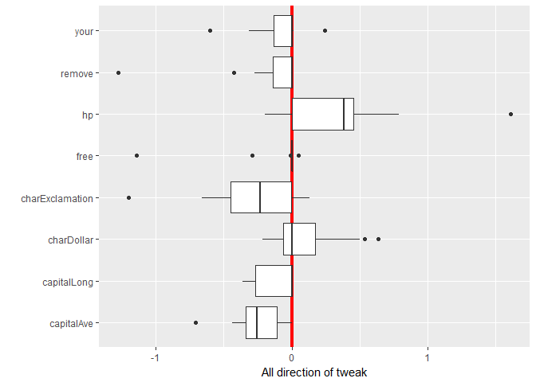

<!-- README.md is generated from README.Rmd. Please edit that file -->
Overview
--------

an implementation to R-package of **Gabriele Tolomei, Fabrizio Silvestri, Andrew Haines, Mounia Lalmas "Interpretable Predictions of Tree-based Ensembles via Actionable Feature Tweaking". KDD 2017. [(arXiv)](https://arxiv.org/abs/1706.06691)**

Installation
------------

You can install the **featureTweakR** package from [GitHub](https://github.com/katokohaku/featureTweakR).

``` r
install.packages("devtools") # if you have not installed "devtools" package
devtools::install_github("hoxo-m/pforeach") # if you have not installed "pforeach" package
devtools::install_github("katokohaku/featureTweakR")
```

The source code for **featureTweakR** package is available on GitHub at

-   <https://github.com/katokohaku/featureTweakR>.

Examples
--------

``` r
require(tidyverse)
#> Warning: package 'tidyverse' was built under R version 3.4.3
#> Warning: package 'tidyr' was built under R version 3.4.3
#> Warning: package 'dplyr' was built under R version 3.4.3
require(featureTweakR)

set.seed(777)

data(spam, package = "kernlab")
dataset <- sample_frac(spam) %>% dataSplit(test.ratio = 0.1)
#> [Split data] train : test = 4141 : 460 obs. (58 colmns)


important.var <- c("charExclamation", "charDollar", "remove", "free", "capitalAve", "capitalLong", "your", "hp")
data.train <- dataset$train %>% select(important.var)
true.y     <- dataset$train[ ,ncol(dataset$train)]


data.test  <- dataset$test  %>% select(important.var) %>% head(50)

es <- learnModel(X.train = data.train, true.y = true.y, ntree = 22)
```


    #> 
    #> Call:
    #>  randomForest(x = train.scaled, y = true.y, ntree = ntree) 
    #>                Type of random forest: classification
    #>                      Number of trees: 22
    #> No. of variables tried at each split: 2
    #> 
    #>         OOB estimate of  error rate: 7.94%
    #> Confusion matrix:
    #>         nonspam spam class.error
    #> nonspam    2372  116  0.04662379
    #> spam        213 1440  0.12885662
    #> 
    #> extracting all (22 of 22 trees)
    #> Time difference of 48.92412 secs
    #> set e-satisfactory instance (22 trees)
    #> Time difference of 42.88313 secs
    ft <- predict(es, newdata = data.test, label.from = "spam", label.to = "nonspam")
    #> 50 instances were predicted by 22 trees: 
    #> 
    #> nonspam    spam 
    #>      35      15 
    #> Time difference of 1.051052 mins

    str(ft,2)
    #> List of 5
    #>  $ scaled    :List of 3
    #>   ..$ predict : Factor w/ 2 levels "nonspam","spam": 1 1 1 2 1 1 1 1 1 1 ...
    #>   .. ..- attr(*, "names")= chr [1:50] "3691" "4543" "2214" "996" ...
    #>   ..$ original: num [1:50, 1:8] -0.326 -0.326 -0.326 -0.0884 -0.326 ...
    #>   .. ..- attr(*, "dimnames")=List of 2
    #>   .. ..- attr(*, "scaled:center")= Named num [1:8] 0.273 0.0768 0.1152 0.2522 5.1945 ...
    #>   .. .. ..- attr(*, "names")= chr [1:8] "charExclamation" "charDollar" "remove" "free" ...
    #>   .. ..- attr(*, "scaled:scale")= Named num [1:8] 0.838 0.252 0.395 0.848 32.751 ...
    #>   .. .. ..- attr(*, "names")= chr [1:8] "charExclamation" "charDollar" "remove" "free" ...
    #>   ..$ suggest : num [1:50, 1:8] -0.326 -0.326 -0.326 -0.319 -0.326 ...
    #>   .. ..- attr(*, "dimnames")=List of 2
    #>   ..- attr(*, "class")= chr "tweaked.suggestion"
    #>  $ descaled  :List of 3
    #>   ..$ original:Classes 'tbl_df', 'tbl' and 'data.frame': 50 obs. of  8 variables:
    #>   ..$ suggest :Classes 'tbl_df', 'tbl' and 'data.frame': 50 obs. of  8 variables:
    #>   ..$ diff    :Classes 'tbl_df', 'tbl' and 'data.frame': 50 obs. of  8 variables:
    #>  $ label.from: chr "spam"
    #>  $ label.tol : chr "nonspam"
    #>  $ target    : int [1:15] 4 11 15 17 18 19 23 26 30 33 ...
    #>  - attr(*, "class")= chr "featureTweak"
    plot(ft, k=4)
    #> instance #4


    #>               key       value
    #> 1      capitalAve -0.70873527
    #> 2     capitalLong  0.00000000
    #> 3      charDollar -0.02183575
    #> 4 charExclamation -0.23080201
    #> 5            free  0.00000000
    #> 6              hp  0.41552252
    #> 7          remove  0.00000000
    #> 8            your -0.31147905


    plot(ft, type = "direction")
    #> [1] "direction"
    #>          variable        mean      median
    #> 1      capitalAve -0.24786163 -0.24786163
    #> 2     capitalLong -0.11833912 -0.11833912
    #> 3      charDollar  0.08887710  0.08887710
    #> 4 charExclamation -0.28949074 -0.28949074
    #> 5            free -0.09297408 -0.09297408
    #> 6              hp  0.34137594  0.34137594
    #> 7          remove -0.15003806 -0.15003806
    #> 8            your -0.08381495 -0.08381495


