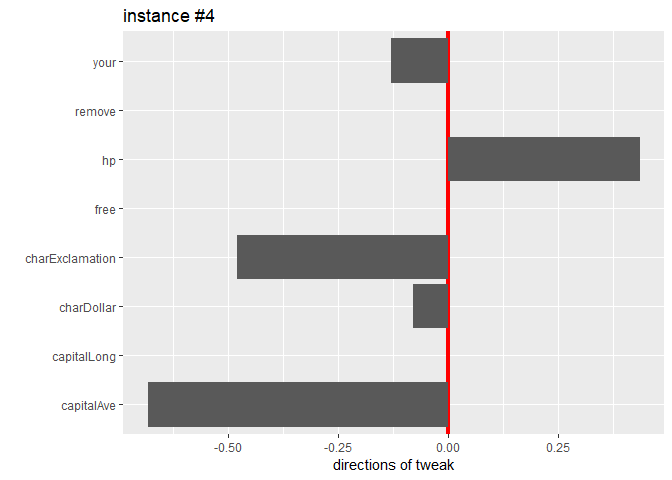

# Overview

An R-package to visualize suggestion how to change variables of an instance to get the desired prediction based on ensemble tree model such as randomForest.

### Preparation


```r
set.seed(777)
require(tidyverse)
require(randomForest)
require(featureTweakR)

data(spam, package = "kernlab")
dataset <- sample_frac(spam) %>% dataSplit(test.ratio = 0.1)
#> [Split data] train : test = 4141 : 460 obs. (58 colmns)

important.var <- c("charExclamation", "charDollar", "remove", "free", "capitalAve", "capitalLong", "your", "hp")
data.train <- dataset$train %>% select(important.var)
true.y     <- dataset$train[ ,ncol(dataset$train)]
data.test  <- dataset$test  %>% select(important.var) %>% head(50)
```

After data preparation, just call wrapper function:

1. `learnModel()` to extract rules from ensemble trees,
2. `predict()` to estimate suggestion for each instance from extracted rules,
3. `plot()` to visualize suggestion or poplation based importances.

### Extract rules


```r
es <- learnModel(X.train = data.train, true.y = true.y, ntree = 25)
#> 
#> Call:
#>  randomForest(x = train.scaled, y = true.y, ntree = ntree) 
#>                Type of random forest: classification
#>                      Number of trees: 25
#> No. of variables tried at each split: 2
#> 
#>         OOB estimate of  error rate: 7.73%
#> Confusion matrix:
#>         nonspam spam class.error
#> nonspam    2377  111  0.04461415
#> spam        209 1444  0.12643678
#> 
#> extracting all (25 of 25 trees)
#> Time difference of 22.04605 secs
#> set e-satisfactory instance (25 trees)
#> Time difference of 11.18177 secs
```

### Estimate suggestions for new instances

Based on learnt model, new instances that were predicted *`label.from`* will be suggested **how to tweaked**

```r
ft <- predict(es, newdata = data.test, 
              label.from = "spam", label.to = "nonspam")
#> 50 instances were predicted by 25 trees: 
#> Time difference of 28.27061 secs
```
### Visualize suggestion

To visualize predicted-population based feature importance, set `type = "direction"`.


```r
plot(ft, type = "direction")
#> [1] "direction"
#>          variable         mean       median
#> 1      capitalAve -0.410701677 -0.410701677
#> 2     capitalLong -0.163625451 -0.163625451
#> 3      charDollar  0.073373763  0.073373763
#> 4 charExclamation -0.237100753 -0.237100753
#> 5            free  0.002478275  0.002478275
#> 6              hp  0.262414439  0.262414439
#> 7          remove -0.062532566 -0.062532566
#> 8            your -0.121496167 -0.121496167
```

<!-- -->

To visualize suggestion how to change variables of k-th instance to get the desired prediction, set `k = ...`


```r
plot(ft, k=4)
#> instance #4
```

<!-- -->

```
#>               key       value
#> 1      capitalAve -0.70873527
#> 2     capitalLong  0.00000000
#> 3      charDollar -0.02183575
#> 4 charExclamation -0.23080201
#> 5            free  0.00000000
#> 6              hp  0.41552252
#> 7          remove  0.00000000
#> 8            your -0.31147905
```

# Details

## Installation

You can install the **featureTweakR** package from [GitHub](https://github.com/katokohaku/featureTweakR).


```r
 # if you have not installed "devtools" package
install.packages("devtools")
 # if you have not installed "pforeach" package
devtools::install_github("hoxo-m/pforeach")

devtools::install_github("katokohaku/featureTweakR")
```

The source code for **featureTweakR** package is available on GitHub at
- https://github.com/katokohaku/featureTweakR.

## data preparation 


```r
set.seed(777)

data(spam, package = "kernlab")
dataset <- sample_frac(spam)
n.test <- floor(NROW(dataset) *0.1)

dataset.train <- chop(dataset, n.test)
dataset.test  <- tail(dataset, n.test)

dim(dataset);dim(dataset.train);dim(dataset.test)
#> [1] 4601   58
#> [1] 4141   58
#> [1] 460  58
```

## exploring randomForest

### build randomForest

To view variable importances and number of trees required. 


```r
X <- dataset.train[, 1:(ncol(dataset.train)-1)]
true.y <- dataset.train[, ncol(dataset.train)]

forest.all <- randomForest(X, true.y, ntree=500)
forest.all
#> 
#> Call:
#>  randomForest(x = X, y = true.y, ntree = 500) 
#>                Type of random forest: classification
#>                      Number of trees: 500
#> No. of variables tried at each split: 7
#> 
#>         OOB estimate of  error rate: 4.68%
#> Confusion matrix:
#>         nonspam spam class.error
#> nonspam    2419   69  0.02773312
#> spam        125 1528  0.07562008
par(mfrow=c(1,2))
varImpPlot(forest.all) # to view varImp, x3 & x4 should be removed.
plot(forest.all)
```

<!-- -->

```r
par(mfrow=c(1,1))
```

### model shrinkage (feature selection) based on importance 


```r
top.importance <- forest.all$importance %>% data.frame %>%
  tibble::rownames_to_column(var = "var") %>% 
  arrange(desc(MeanDecreaseGini)) %>% 
  head(12)
top.importance
#>                var MeanDecreaseGini
#> 1  charExclamation        233.10749
#> 2       charDollar        182.18634
#> 3           remove        156.11771
#> 4             free        125.10162
#> 5       capitalAve        120.33568
#> 6             your        117.43448
#> 7      capitalLong        114.53881
#> 8               hp         89.87726
#> 9     capitalTotal         76.92826
#> 10           money         76.48014
#> 11             our         61.53394
#> 12          num000         53.16746

dataset.train.fs <- dataset.train %>% select(top.importance$var)
dataset.test.fs  <- dataset.test %>% select(top.importance$var)
```

### scaling feature-selected data  


```r
X.train <- scale( dataset.train.fs )
X.test  <- rescale( dataset.test.fs, scaled = X.train )

dataset.test.fs[1:6, 1:6]
#>      charExclamation charDollar remove free capitalAve your
#> 3691           0.000          0   0.00 0.00      1.400 0.00
#> 4543           0.000          0   0.00 0.00      2.272 0.00
#> 2214           0.000          0   0.00 0.00      1.433 0.75
#> 996            0.199          0   1.65 2.47     15.892 0.82
#> 3616           0.000          0   0.00 0.00      1.000 0.00
#> 2048           0.000          0   0.00 0.00      1.250 0.00
descale(X.test, scaled = X.train)[1:6, 1:6]
#> # A tibble: 6 x 6
#>   charExclamation charDollar    remove  free capitalAve  your
#>             <dbl>      <dbl>     <dbl> <dbl>      <dbl> <dbl>
#> 1           0              0 -1.39e-17  0          1.4   0   
#> 2           0              0 -1.39e-17  0          2.27  0   
#> 3           0              0 -1.39e-17  0          1.43  0.75
#> 4           0.199          0  1.65e+ 0  2.47      15.9   0.82
#> 5           0              0 -1.39e-17  0          1     0   
#> 6           0              0 -1.39e-17  0          1.25  0
descale(X.test, scaled = X.test)[1:6, 1:6]
#> # A tibble: 6 x 6
#>   charExclamation charDollar    remove  free capitalAve  your
#>             <dbl>      <dbl>     <dbl> <dbl>      <dbl> <dbl>
#> 1           0              0 -1.39e-17  0          1.4   0   
#> 2           0              0 -1.39e-17  0          2.27  0   
#> 3           0              0 -1.39e-17  0          1.43  0.75
#> 4           0.199          0  1.65e+ 0  2.47      15.9   0.82
#> 5           0              0 -1.39e-17  0          1     0   
#> 6           0              0 -1.39e-17  0          1.25  0
```

### performance comparison forest with all-feature v.s. selected-features


```r
forest.rf <- randomForest(X.train, true.y, ntree=100)

forest.all
#> 
#> Call:
#>  randomForest(x = X, y = true.y, ntree = 500) 
#>                Type of random forest: classification
#>                      Number of trees: 500
#> No. of variables tried at each split: 7
#> 
#>         OOB estimate of  error rate: 4.68%
#> Confusion matrix:
#>         nonspam spam class.error
#> nonspam    2419   69  0.02773312
#> spam        125 1528  0.07562008
forest.rf
#> 
#> Call:
#>  randomForest(x = X.train, y = true.y, ntree = 100) 
#>                Type of random forest: classification
#>                      Number of trees: 100
#> No. of variables tried at each split: 3
#> 
#>         OOB estimate of  error rate: 6.42%
#> Confusion matrix:
#>         nonspam spam class.error
#> nonspam    2392   96  0.03858521
#> spam        170 1483  0.10284332
plot(forest.rf)
```

<!-- -->

## Step-by-step procedure

After build forest, steps to obtain suggestions **without wrapper functios** are:

1. rule extraction
2. get modified(tweaked) rules
3. get the best tweaked rule (the suggestion) for each instance
4. restore suggestion to real scale.
5. visualize

### extract rules


```r
rules <- getRules(forest.rf, ktree = NULL, resample = TRUE)
#> extracting all (100 of 100 trees)
#> Time difference of 1.405599 mins
# rules[[1]]
```

### set modified rules (e-satisfactory instances)

```r
es.rf <- set.eSatisfactory(rules, epsiron = 0.3)
#> set e-satisfactory instance (100 trees)
#> Time difference of 34.798 secs
# es.rf[[1]]
```

### predict individual suggestion for each instance

```r

tweaked <- tweak(es.rf, forest.rf, newdata= X.test, 
                 label.from = "spam", label.to = "nonspam", .dopar = TRUE)
#> 460 instances were predicted by 100 trees: 
#> Time difference of 18.86293 mins

str(tweaked,1,vec.len = 2)
#> List of 3
#>  $ predict : Factor w/ 2 levels "nonspam","spam": 1 1 1 2 1 ...
#>   ..- attr(*, "names")= chr [1:460] "3691" "4543" ...
#>  $ original: num [1:460, 1:12] -0.326 -0.326 ...
#>   ..- attr(*, "dimnames")=List of 2
#>   ..- attr(*, "scaled:center")= Named num [1:12] 0.273 0.0768 ...
#>   .. ..- attr(*, "names")= chr [1:12] "charExclamation" "charDollar" ...
#>   ..- attr(*, "scaled:scale")= Named num [1:12] 0.838 0.252 ...
#>   .. ..- attr(*, "names")= chr [1:12] "charExclamation" "charDollar" ...
#>  $ suggest : num [1:460, 1:12] -0.326 -0.326 ...
#>   ..- attr(*, "dimnames")=List of 2
#>  - attr(*, "class")= chr "tweaked.suggestion"
```
### restore suggestion from scaled feature to original scale.


```r
dt <- descale.tweakedFeature(tweaked, X.test)
```

### Visualize suggestion

To visualize predicted-population based feature importance, set `type = "direction"`.


```r
plot(tweaked, type = "direction")
#> [1] "direction"
#>           variable         mean       median
#> 1       capitalAve -0.174883119 -0.174883119
#> 2      capitalLong -0.044896979 -0.044896979
#> 3     capitalTotal -0.004171686 -0.004171686
#> 4       charDollar -0.074792106 -0.074792106
#> 5  charExclamation -0.119561396 -0.119561396
#> 6             free -0.102822905 -0.102822905
#> 7               hp  0.398982011  0.398982011
#> 8            money  0.003619531  0.003619531
#> 9           num000  0.004964694  0.004964694
#> 10             our -0.044917348 -0.044917348
#> 11          remove -0.189543132 -0.189543132
#> 12            your -0.030203827 -0.030203827
```

<!-- -->

To visualize suggestion how to change variables of k-th instance to get the desired prediction, set `k = ...`


```r
plotSuggest(tweaked, k=4)
#> instance #4
```

<!-- -->

```
#>                key       value
#> 1       capitalAve -0.07733527
#> 2      capitalLong -1.28309739
#> 3     capitalTotal  0.00000000
#> 4       charDollar  0.00000000
#> 5  charExclamation  0.18719799
#> 6             free -3.20018154
#> 7               hp  1.25202252
#> 8            money  0.00000000
#> 9           num000  0.00000000
#> 10             our  0.00000000
#> 11          remove  0.00000000
#> 12            your -0.46227905
```
To view only non-zero variable or sorted values, set `.ordered = TRUE``.nonzero.only = TRUE`, respectively.


```r
plotSuggest(tweaked, k=4, .ordered = TRUE, .nonzero.only = TRUE)
#> instance #4
```

<!-- -->

```
#>               key       value
#> 1      capitalAve -0.07733527
#> 2 charExclamation  0.18719799
#> 3            your -0.46227905
#> 4              hp  1.25202252
#> 5     capitalLong -1.28309739
#> 6            free -3.20018154
```

# References

**Gabriele Tolomei, Fabrizio Silvestri, Andrew Haines, Mounia Lalmas "Interpretable Predictions of Tree-based Ensembles via Actionable Feature Tweaking". [KDD 2017](http://www.kdd.org/kdd2017/papers/view/interpretable-predictions-of-tree-based-ensembles-via-actionable-feature-tw) or [arXiv paper](https://arxiv.org/abs/1706.06691)**

